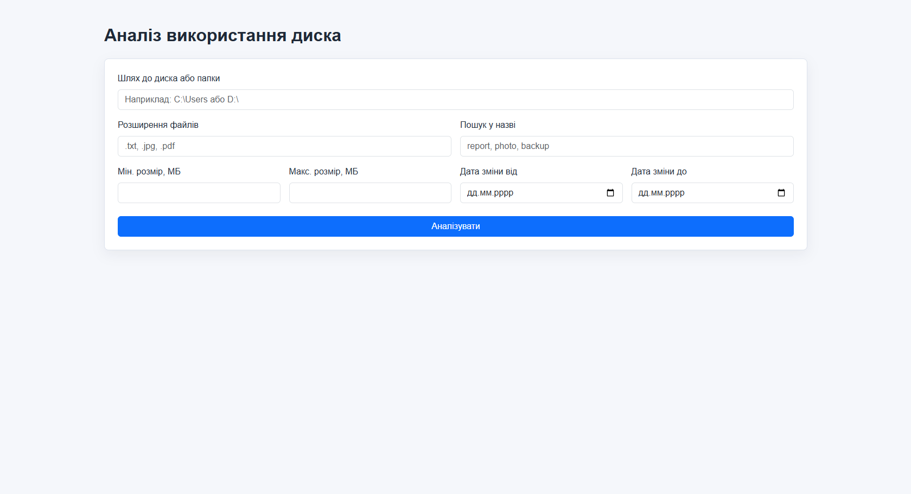
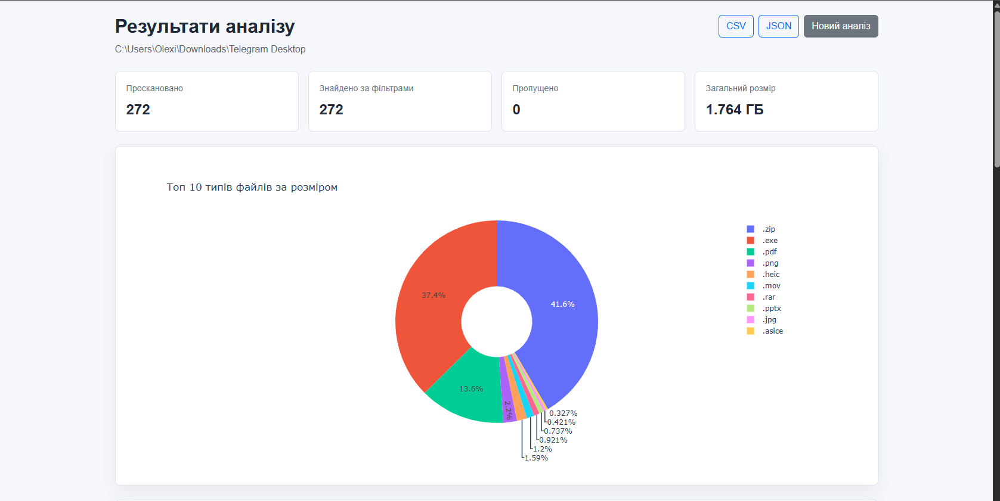
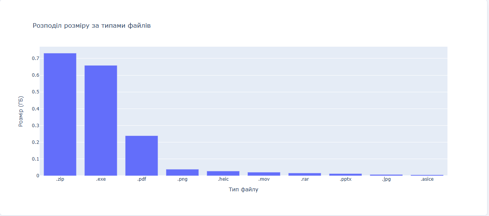
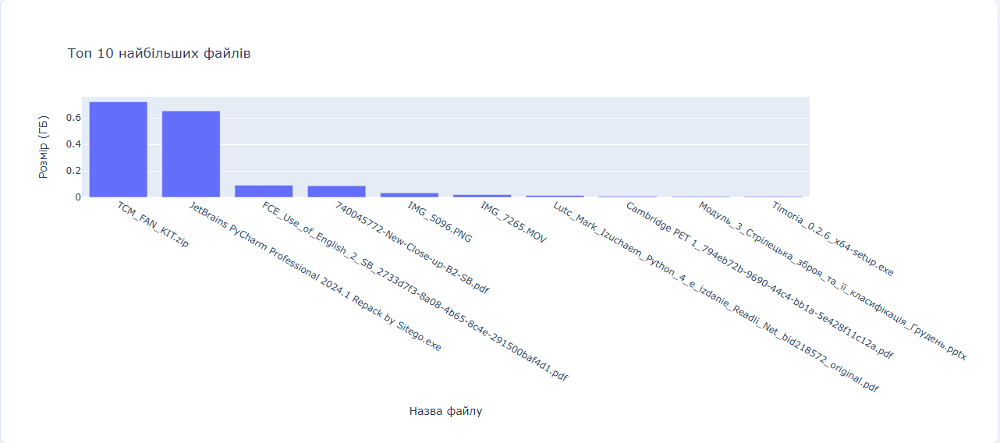

# Disk Directory Analyzer


---

## Overview

**Disk Directory Analyzer** is a local-first Flask web application for scanning folders and analyzing disk usage.

The app helps users understand which file types and individual files take the most space. It provides interactive Plotly charts, file filters, real-time scan progress, a results table, and report export to CSV or JSON.

This project is designed as a portfolio-friendly local utility: it runs on the user's machine and analyzes local folders without uploading files anywhere.

---

## Features

- Analyze any local folder or disk path
- Real-time scan progress in the browser
- Interactive Plotly charts
- Top 10 file extensions by total size
- Top 10 largest files
- File filtering by:
  - extension
  - file name
  - minimum size
  - maximum size
  - modification date range
- Results table with full file paths
- Export scan results to CSV
- Export scan results to JSON
- Local-only execution for safer filesystem access
- Clean Flask + Jinja2 structure

---

## Screenshots


### 1. Scan Form



### 2. Top Type Files Table



### 3. Top Type Size Files Table



### 4. Largest Files Table



---

## Tech Stack

| Technology | Purpose |
| --- | --- |
| Python | Core application language |
| Flask | Web framework |
| Flask-SocketIO | Real-time scan progress |
| Plotly | Interactive charts |
| Jinja2 | HTML templating |
| HTML5 | Page structure |
| CSS3 | Styling |
| python-dotenv | Optional environment configuration |

---

## Project Structure

```text
disk_directory_analyzer/
|-- app.py
|-- requirements
|-- README.md
|-- .gitignore
`-- DiskUsageAnalyzer/
    |-- __init__.py
    |-- main.py
    |-- utils.py
    |-- static/
    |   `-- styles.css
    `-- templates/
        |-- select_disk.html
        `-- analysis_results.html
```

---

## Installation

### 1. Clone the repository

```bash
git clone https://github.com/santar4/disk_directory_analyzer.git
cd disk_directory_analyzer
```

### 2. Create a virtual environment

```bash
python -m venv .venv
```

### 3. Activate the virtual environment

Windows:

```bash
.venv\Scripts\activate
```

macOS / Linux:

```bash
source .venv/bin/activate
```

### 4. Install dependencies

```bash
pip install -r requirements
```

---

## Running the App

```bash
python app.py
```

Open the app in your browser:

```text
http://127.0.0.1:5000
```

---

## Usage

1. Enter a folder or disk path, for example:

```text
C:\Users\YourName\Downloads
```

2. Optionally add filters:
   - `.jpg, .png, .pdf`
   - part of a file name
   - minimum or maximum size in MB
   - date range

3. Start the scan.

4. Wait for the browser progress indicator.

5. Review charts, summary cards, and the largest files table.

6. Export results as CSV or JSON if needed.

---

## Local-First Security Note

This application is intended to be used as a **local utility**.

It should be run on:

```text
127.0.0.1
```

The app reads file metadata from the selected local folder. It does not upload files to any external server.

For portfolio/demo usage, this is the recommended model because disk analysis requires access to the user's filesystem.

---

## Development Notes

The project uses Flask-SocketIO for background scanning progress. The scan itself is executed in a separate thread so the browser can continue receiving progress updates while files are being processed.

The core scan logic is located in:

```text
DiskUsageAnalyzer/utils.py
```

Main responsibilities:

- path validation
- file traversal
- filter application
- result aggregation
- chart generation
- CSV/JSON export

---

## Possible Improvements

- Folder picker from the operating system dialog
- Unit tests for filtering and export logic
- Pagination for very large result tables
- Export full scan results instead of only top files
- Dark mode
- Packaged desktop version with PyInstaller
- Optional scan history stored locally

---

## Portfolio Summary

This project demonstrates:

- backend development with Flask
- real-time browser updates with WebSockets
- filesystem traversal and data aggregation
- interactive data visualization
- clean user-facing reports
- practical local tool design

It is a strong example of a Python web utility that solves a real everyday problem: understanding what takes space on a disk.
